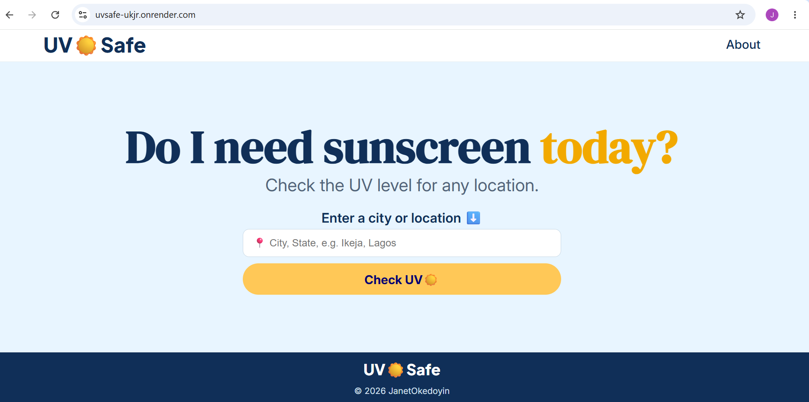
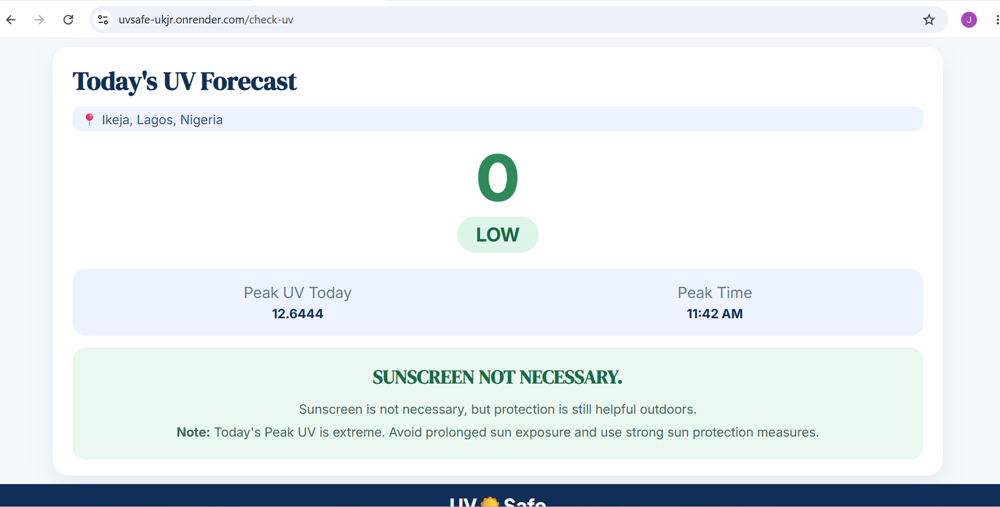

#  UV☀️Safe

### Check the UV level for any location and know when to use sunscreen.

**UV☀️Safe** is a responsive web application that allows users to enter a city or location and check its UV conditions.

The project was built as a practical way to learn how to work public APIs using Node.js, Express.js, Axios and EJS.


## 🚀 Live Demo

**[Try UV-Safe](https://uvsafe-ukjr.onrender.com/)**

## 📸 Preview






## 🛠️ Technologies Used

### Frontend

* HTML5
* CSS3
* EJS

### Backend

* Node.js
* Express.js
* Axios

### APIs

* Open-Meteo Geocoding API
* OpenUV API

### Deployment

* Render

## 🔄 How It Works

UV☀️Safe uses two APIs to retrieve and display UV information.

```text
1. The user enters a city or location.
2. UV-Safe sends the location to the Open-Meteo Geocoding API.
3. Open-Meteo returns the latitude and longitude of the location.
4. The coordinates are sent to the OpenUV API.
5. OpenUV returns the UV information.
6. UV-Safe displays the results and sunscreen recommendations.

```

## ⚙️ Getting Started

To run UV☀️Safe locally, follow the steps below.

### 1. Clone the repository

```bash
git clone https://github.com/Bimbzzyjane/uvSafe-api-project.git
```

### 2. Enter the project folder

```bash
cd 'Use Public API Project'
```

### 3. Install dependencies

```bash
npm i
```

### 4. Create a `.env` file

Create a `.env` file in the root directory.

Add your OpenUV API key:
OPENUV_API_KEY = your_api_key_here

Replace `your_api_key_here` with your actual OpenUV API key.

### 5. Start the server

Using nodemon:

```bash
nodemon index.js
```

Or using the npm start command:

```bash
npm start
```

The application will run locally at:

```text
http://localhost:3000
```

## 👩🏽‍💻 Author

**Janet Okedoyin**

